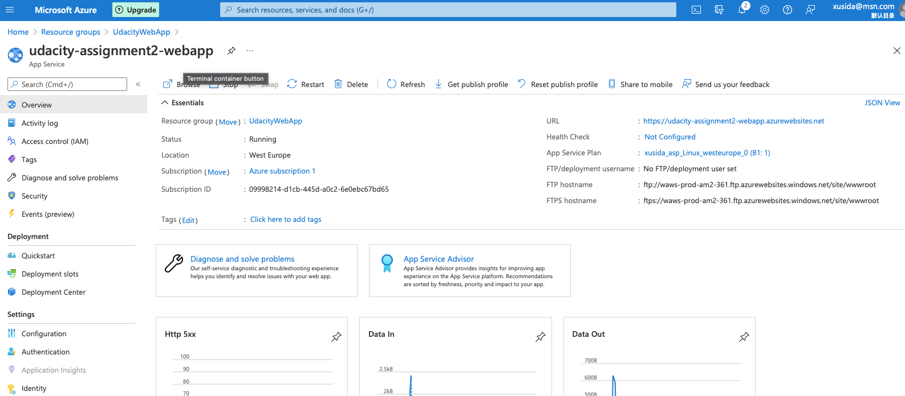

[](https://github.com/sida8855/udacity-azure-assignment2/actions/workflows/pythonapp.yml)

# Overview

This project is the second assignment for Udacity Azure DevOps nanodegree program. 
In this project we will start with a project plan and visualize it in Trello. Then we will deploy a flask based webapp to Azure WebApp. Using GitHub Action to trigger a build and quality check if any new commit to this Git happens. And a Azure DevOps Pipeline will also trigger an automatic deployment on Azure WebApp. So we can achive a complete CI/CD chain.

## Project Plan
The project plan is composed with Excel and a Trello board will be used to track the progress.

* A link to a Trello board for the project: [Trello Board](https://trello.com/b/AqHIn4q4/building-a-ci-cd-pipeline)
* A link to a spreadsheet: [Project Plan](./project_plan/project-plan.xlsx)

## Instructions

* Architectural Diagram 


* Project cloned into Azure Cloud Shell

Open Azure shell and pair the SSH keys with your GitHub account. Then we can clone the repo with command:
```
git clone git@github.com:sida8855/udacity-azure-assignment2.git
```


* Project running on Azure App Service
  - run `make setupenv` to set up a virtual python environment 
  - run `source ~/.udacity-devops/bin/activate` to activate virtual environment
  - run `make all` to install dependencies and run lint check and test the code, if successful you will see like following:
  

If you want to run the code first on localhost, you can run `python app.py`. If you want to see the prediction result, please open a new terminal and run `./make_prediction.sh`. If the app is running correctly, you will see following:


Next step is run the app on Azure WebApp. First we need to create a resource group:
```
az group create --resource-group <resource_group> --location westeurope
```
Then we can run the following command:
```
az webapp up -n <webapp_name> -g <resource_group> -l westeurope --sku B1
```
You will find the webapp is running in the portal:


To run the prediction, you need to adapt the file "make_predict_azure_app.sh" line 28 to replace the application with your defined name. Then we can run `./make_predict_azure_app.sh`. You shall see followings if it runs correctly:


The log will be displayed using this command:
```
az webapp log tail -g <resource_group> -n <webapp_name>
```
The result is like following:


* Set up GitHub Actions

Create a new workflow using GitHub Actions. Click "set up a workflow yourself" and using following yml template:
```
name: Python application test with Github Actions

on: [push]

jobs:
  build:

    runs-on: ubuntu-latest

    steps:
    - uses: actions/checkout@v2
    - name: Set up Python 3.5
      uses: actions/setup-python@v1
      with:
        python-version: 3.5
    - name: Install dependencies
      run: |
        make install
    - name: Lint with pylint
      run: |
        make lint
    - name: Test with pytest
      run: |
        make test
```
Now you will see the status of the workflow. And this workflow will start automatically after you commit a change of code. 


* Set up Azure Pipeline

Following the steps documented by Microsoft. [Set up Azure Pipeline](https://docs.microsoft.com/en-us/azure/devops/pipelines/ecosystems/python-webapp?view=azure-devops).

After successful set up, you will see following:


* Load Test using Locust

Using Python module locust we can run load test to our web application.

  -- Install locust `pip install locust`
  
  -- Run locust `locust`

Then open http://localhost:8089 and give the address of our web application and we can see some result:


## Enhancements
* More detailed tests using test scripts
* Using Docker and Kubernetes
* Branch strategy to test App on Branch and merge to Main if successful

## Demo 

<TODO: Add link YouTube>


